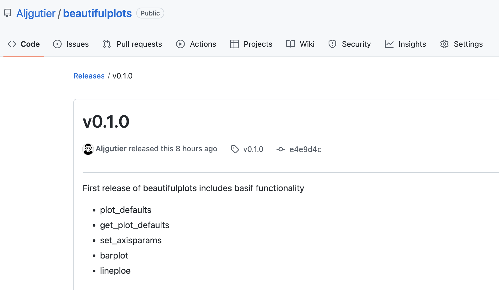

# Python Packaging (Notes)

[Python Packages Book](https://py-pkgs.org/)

by Tomas Beuzen & Tiffany Timbers

# Chapter 2, Setup

  * Section 2.2.1 Python

    * Python including version number installed in Conda Environment
    * Pythonpath needs to be specified for the src and doc directories (example.ipynb) (learned by experience)

  ```
   pythonpath_setup.sh
        export PYTHONPATH="$PYTHONPATH:./src/<packagename>:../src/<packagename>"

   > cd package_name
   > pythonpath_setup.sh
  ```

  * Section 2.2.2. Packaging Software
    * poetry https://python-poetry.org/docs/
    * cookiecutter

    ```
    The get-poetry.py script described here will be replaced in
    Poetry 1.2 by install-poetry.py. From Poetry 1.1.7 onwards,
    you can already use this script as described here.

    curl -sSL https://raw.githubusercontent.com/python-poetry/poetry/master/get-poetry.py | python -

    $ conda install -c conda-forge cookiecutter
    ```
  * Section 2.3 PyPy
    * Register for PyPy account
    * Register for testPyPy account

  * Visual Studio

  * Jupyter


# Chapter 3, Creating a Package

 * Section 3.2.1 Package Structure Introduction

 * Section 3.3 Version Control
    * Git Setup ... go to section 3.5

* Section 3.2.2 Creating Package Structure
  * **go to section 3.5 **

* Secton 3.4 **Packagng Your Code**
  * go to Section 3.5  cookie cutter
   ```
       ./src/package_name/packag_name.py
   ```

* Section 3.5  **Conda Virtual Environment, Package Install**
  * see code below ... virtual env >> cookie cutter >> add code  >> package install
    ```
    # 1)  virtual environment
    > conda create --name beautifulplots python=3.8 -y
    > conda activate beautifulplots


    # 2) package structure with cookiecutter
    > conda install -c conda-forge cookiecutter
        # one directory above ... creates packagename directory

    # 3) Package Structure
    > cookiecutter https://github.com/py-pkgs/py-pkgs-cookiecutter.git

    # 4) Git Repo Online

    # 5)  cd to workspace/package_directory
    > git init ...

    # 6) put code in ~/src/kale/kale.py

    # 7 push to git
        > git add .
        > git commit -m "feat: check in initial package"
        > git branch -M main
        > git remote add origin https://github.com/Aljgutier/beautifulplots.git
        > git push origin main


    # 7)
    $ poetry install  # writes the lock file (package dependencies)


    # 8)
    $ git add src/pycounts/kale.py
    $ git commit -m "feat: kale source code"
    $ git push
    ```


* Section 3.6 **Adding dependencies**
  * pyproject.toml poetry.lock
  * we recommend specifying version constraints without an upper cap by manually changing poetry’s default caret operator (^) to a greater-than-or-equal-to sign (>=)

   ```
  [tool.poetry.dependencies]
  python = ">=3.9"
  matplotlib = ">=3.4.3"
  ```

  ```
  $ poetry add matplotlib
  $ poetry add seaborn
  $ poetry add pandas

  $ git add pyproject.toml  
  $ git commit -m "build: remove upper bound on dependency versions"
  $ git push
  ```

* Section 3.7 testing
  * poetry add --dev pytest
  * create test file in tests/test_kale.py
  * pytest tests/  # run tests
  * poetry add --dev pytest-cov # test coverage
  * pytest tests/ --cov=beautifulplots


 * Section 3.8 **Building Documentation**

  * Sphinx
  * myst ... Markedly Styled Text
 ```
  > poetry add --dev myst-nb --python "^3.8"
  > poetry add --dev sphinx-autoapi sphinx-rtd-theme

  > cd ./docs
  > make html
  > cd ./_build/html
  > open index.html
 ```

  * Jupyter notebook
    * poetry add --dev jupyter

 ```
   > poetry add --dev jupyter
   > jupyter notebook
 ```

 ```

  cd ..
  > git add README.md docs/example.ipynb
  > git commit -m "docs: updated readme and example"
  > git add src/pycounts/pycounts.py src/pycounts/plotting.py
  > git commit -m "docs: created docstrings for package functions"
  > git add pyproject.toml poetry.lock
  > git commit -m "build: added dev dependencies for docs"
  >git push
 ```

 * Section 3.8.5 **Hosting Documentation Online**

    * https://readthedocs.org/
    * associate git account with your read the docs account
    * Create a new packag/project ... add the git repo from your linked account
    * Build latest

 * Section 3.9 **Tagging Package with Version**

   * tag your local branch
    ```
    > update the version in project.toml and commit
    > git tag v0.1.0
    > git push --tags
    > git tag -l # list local tags
    > git tag -d v2.0 # delete local tag
    > git ls-remote --tags origin # list remote tags
    > git push --delete origin v1.0 # delete remote tag
    ```
  * git online package your release and associate with the tag

  

* Section 3.10 **Building and Distributing Your Package**

  * > poetry build
    * sdist - software distribution
    * wheel - prebuilt distribution

  * pip install wheel
    * > cd dist/
    * >pip install beautifulplots-0.1.1-py3-none-any.whl

  * pip install sdist
    * tar xzf beautifulplots-0.1.1.tar.gz
    * pip install beautifulplots-0.1.1/

  * Section 3.10.2 **Publishing to testPyPi**

    * add testPyPi to Poetry repositories
    * poetry config repositories.test-pypi https://test.pypi.org/legacy/
    * **poetry publish -r test-pypi** # you will need login and password
    * Install to a local environment
      * login to testPyPi and navigate to your project (beautifulplots)
      * copy the install link at top e.g., pip install -i https:test.pypi.org/simple ...
      * On your comptuter activate a python virtual environment with Python 3.8 or higher
      * install with pip (as copied above)

  * Section 3.10.2 **Publishing to PyPy**

* Section 3.11 **Summary Steps and Next Steps**


# Chapter 7 Releasing and Versioning

* git commit -m types
  * \<type> refers to the kind of change made and is usually one of:
  * feat: A new feature.
  * fix: A bug fix.
  * docs: Documentation changes.
  * style: Changes that do not affect the meaning of the code (white- space, formatting, missing semi-colons, etc).
  * refactor: A code change that neither fixes a bug nor adds a feature.
  * perf: A code change that improves performance.
  * test: Changes to the test framework.
  * build: Changes to the build process or tools.

```
