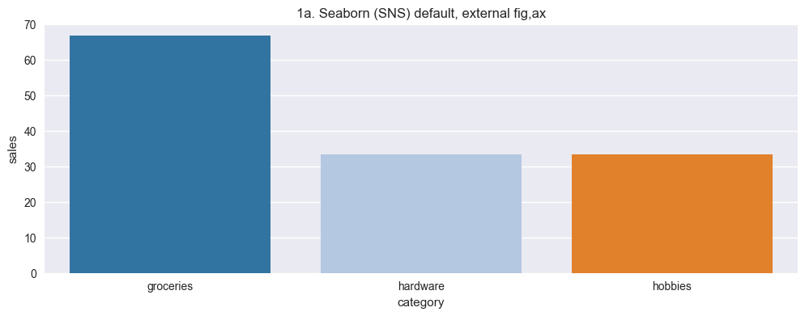
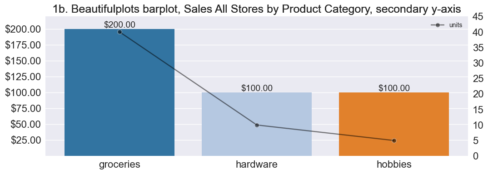
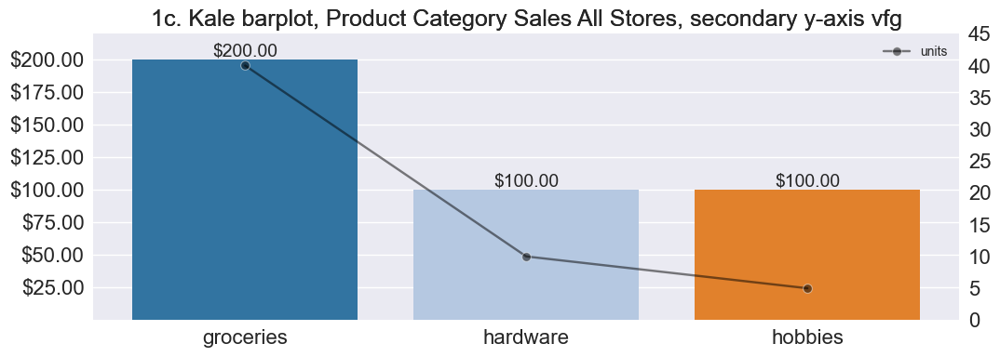
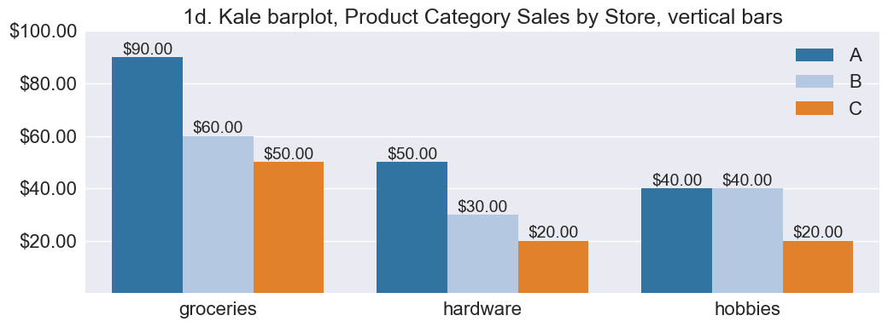
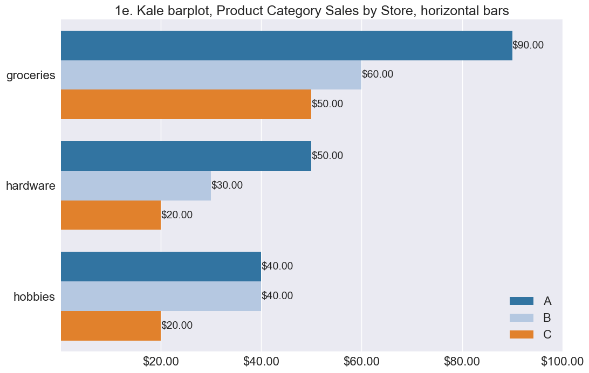
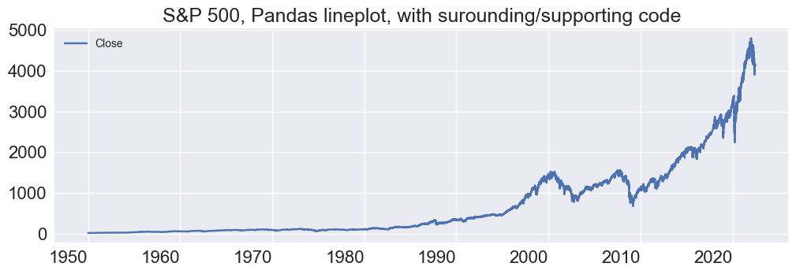
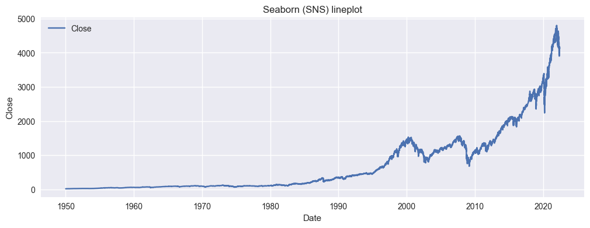
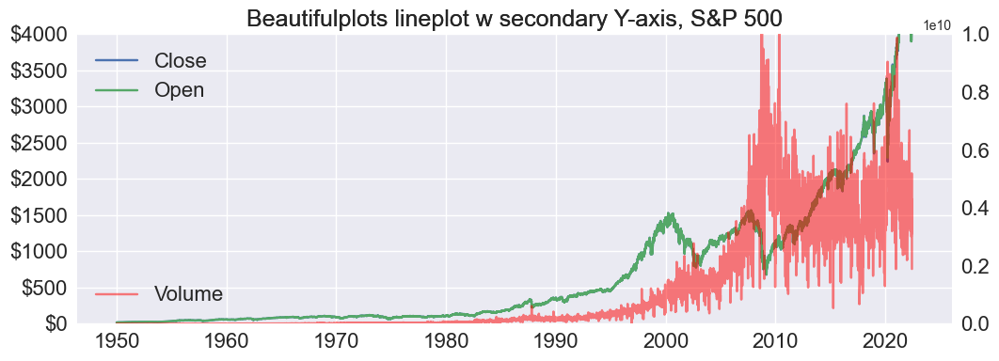

# Examples


```python
import beautifulplots as bp
import matplotlib.pyplot as plt
import pandas as pd
import seaborn as sns
```

# Barplot


```python
# Create a DataFrame with the needed information

# reset defaults for these examples
import matplotlib as mpl
mpl.rcParams.update(mpl.rcParamsDefault)

# data 
print('Data:Product Category Sales by Store')
barplot_data = { 'category':['groceries','groceries','groceries', 'hardware','hardware','hardware','hobbies','hobbies','hobbies'] ,
                'sales':[ 90, 60,50, 50,30,20,40,40,20], 'store':['A','B','C','A','B','C','A','B','C'] }

df = pd.DataFrame(barplot_data)
# create unit sales by category ... assume some average sale price per category
def unit_sales(row):
    units = 0
    if row['category'] == 'groceries': units = row['sales']/5
    elif row['category'] == 'hardware': units = row['sales']/10
    elif row['category'] == 'hobbies': units = row['sales']/20
    return units
df['units']= df.apply(lambda row: unit_sales(row),axis=1)
display(df)


# Example 1a:  Seaborn default with built automatic fig,ax 
sns.barplot(x='category',y='sales',ci=None, data=df, palette ='tab20').set_title('1a. Seaborn default parameters, internal-automaic fig, ax')


# Example 1b: Seaborn default w external fig,ax 
plt.style.use('seaborn')
fig,ax = plt.subplots(nrows=1,ncols=1,figsize=(12,4))
sns.barplot(x='category',y='sales', data=df, ci=None, palette ='tab20').set_title('1b. Seaborn (SNS) default, external fig,ax')
plt.show()


# Example 1c
bp.barplot(df,'category','sales', palette='tab20', 
                   title='1c. Kale barplot, Product Category Sales All Stores, secondary y-axis vfg', figsize=(12,4),
                   bardatalabels=True, bardataformat=".2f", barcurrency=True, ylims = (0.1,220), 
                   y2='units',ylims2=(0,45), color2='black',marker2="o")

# Example 1d
bp.barplot(df,'category','sales',hue='store', palette='tab20', 
                   title='1d. Kale barplot, Product Category Sales by Store, vertical bars', figsize=(12,4), legend=True,
                   bardatalabels=True, bardataformat=".2f", barcurrency=True, ylims = (0.1,100))

# Example 1e
bp.barplot(df,'category','sales',hue='store', palette='tab20', 
                   title='1e. Kale barplot, Product Category Sales by Store, horizontal bars', figsize=(12,8), 
                   bardatalabels=True, bardataformat=".2f", barcurrency=True, bar_orientation='h',
                   xlims = (0.1,100), legend=True, legendloc="lower right")


```

    Data:Product Category Sales by Store


<div>
<style scoped>
    .dataframe tbody tr th:only-of-type {
        vertical-align: middle;
    }

    .dataframe tbody tr th {
        vertical-align: top;
    }

    .dataframe thead th {
        text-align: right;
    }
</style>
<table border="1" class="dataframe">
  <thead>
    <tr style="text-align: right;">
      <th></th>
      <th>category</th>
      <th>sales</th>
      <th>store</th>
      <th>units</th>
    </tr>
  </thead>
  <tbody>
    <tr>
      <th>0</th>
      <td>groceries</td>
      <td>90</td>
      <td>A</td>
      <td>18.0</td>
    </tr>
    <tr>
      <th>1</th>
      <td>groceries</td>
      <td>60</td>
      <td>B</td>
      <td>12.0</td>
    </tr>
    <tr>
      <th>2</th>
      <td>groceries</td>
      <td>50</td>
      <td>C</td>
      <td>10.0</td>
    </tr>
    <tr>
      <th>3</th>
      <td>hardware</td>
      <td>50</td>
      <td>A</td>
      <td>5.0</td>
    </tr>
    <tr>
      <th>4</th>
      <td>hardware</td>
      <td>30</td>
      <td>B</td>
      <td>3.0</td>
    </tr>
    <tr>
      <th>5</th>
      <td>hardware</td>
      <td>20</td>
      <td>C</td>
      <td>2.0</td>
    </tr>
    <tr>
      <th>6</th>
      <td>hobbies</td>
      <td>40</td>
      <td>A</td>
      <td>2.0</td>
    </tr>
    <tr>
      <th>7</th>
      <td>hobbies</td>
      <td>40</td>
      <td>B</td>
      <td>2.0</td>
    </tr>
    <tr>
      <th>8</th>
      <td>hobbies</td>
      <td>20</td>
      <td>C</td>
      <td>1.0</td>
    </tr>
  </tbody>
</table>
</div>


    

    


    

    


    

    


    

    


    

    


# Lineplot, Stock Market S&P 500


```python

# DataFrame with the needed information
# reset defaults for these examples
import matplotlib as mpl
import datetime as dt
mpl.rcParams.update(mpl.rcParamsDefault) # reset plot/figure parameters

sp500_file =  './data/GSPC_1950-1-3_to_2022-6-8.csv'
df_sp500 = pd.read_csv(sp500_file,index_col=0,parse_dates=True)
display(df_sp500.head())

# Pandas Plot ... use plot_options for improving the graph 
print('Pandas lineplot')
plt.style.use('seaborn')
fig,ax = plt.subplots(nrows=1,ncols=1,figsize=(12,4))
plot_options = bp.plot_defaults()
plot_options['title']="S&P 500, Pandas lineplot, with surounding/supporting code"
g=df_sp500.plot(y='Close',ax=ax)  # note, it handles date index well
bp.set_axisparams(plot_options,ax,g)
plt.show()

# reset index ...  Seaborn requires x-axis to be a column 
df = df_sp500.reset_index() 
display(df)

# sns with external ax
plt.style.use('seaborn')
fig,ax = plt.subplots(nrows=1,ncols=1,figsize=(12,4))
g=sns.lineplot(data=df, x="Date", y='Close', label='Close', ax=ax, hue=None).set(title='SNS lineplot')
plt.show()


# mph lineplot
bp.lineplot(df,x='Date' , y=['Close','Open'], y2='Volume', 
             ylims=(0,4000), ylims2=(0,10*1e9), legend_loc2 = "lower left", color2='red',
             figsize=[12,4],yaxis_currency=True, legend=True,
             ytick_format=".0f", title="S&P 500, Kale lineplot")


```


<div>
<style scoped>
    .dataframe tbody tr th:only-of-type {
        vertical-align: middle;
    }

    .dataframe tbody tr th {
        vertical-align: top;
    }

    .dataframe thead th {
        text-align: right;
    }
</style>
<table border="1" class="dataframe">
  <thead>
    <tr style="text-align: right;">
      <th></th>
      <th>Close</th>
      <th>High</th>
      <th>Low</th>
      <th>Open</th>
      <th>Volume</th>
      <th>Adj Close</th>
    </tr>
    <tr>
      <th>Date</th>
      <th></th>
      <th></th>
      <th></th>
      <th></th>
      <th></th>
      <th></th>
    </tr>
  </thead>
  <tbody>
    <tr>
      <th>1950-01-03</th>
      <td>16.66</td>
      <td>16.66</td>
      <td>16.66</td>
      <td>16.66</td>
      <td>1260000.0</td>
      <td>NaN</td>
    </tr>
    <tr>
      <th>1950-01-04</th>
      <td>16.85</td>
      <td>16.85</td>
      <td>16.85</td>
      <td>16.85</td>
      <td>1890000.0</td>
      <td>NaN</td>
    </tr>
    <tr>
      <th>1950-01-05</th>
      <td>16.93</td>
      <td>16.93</td>
      <td>16.93</td>
      <td>16.93</td>
      <td>2550000.0</td>
      <td>NaN</td>
    </tr>
    <tr>
      <th>1950-01-06</th>
      <td>16.98</td>
      <td>16.98</td>
      <td>16.98</td>
      <td>16.98</td>
      <td>2010000.0</td>
      <td>NaN</td>
    </tr>
    <tr>
      <th>1950-01-09</th>
      <td>17.08</td>
      <td>17.08</td>
      <td>17.08</td>
      <td>17.08</td>
      <td>2520000.0</td>
      <td>NaN</td>
    </tr>
  </tbody>
</table>
</div>


    Pandas lineplot


    

    


<div>
<style scoped>
    .dataframe tbody tr th:only-of-type {
        vertical-align: middle;
    }

    .dataframe tbody tr th {
        vertical-align: top;
    }

    .dataframe thead th {
        text-align: right;
    }
</style>
<table border="1" class="dataframe">
  <thead>
    <tr style="text-align: right;">
      <th></th>
      <th>Date</th>
      <th>Close</th>
      <th>High</th>
      <th>Low</th>
      <th>Open</th>
      <th>Volume</th>
      <th>Adj Close</th>
    </tr>
  </thead>
  <tbody>
    <tr>
      <th>0</th>
      <td>1950-01-03</td>
      <td>16.660000</td>
      <td>16.660000</td>
      <td>16.660000</td>
      <td>16.660000</td>
      <td>1.260000e+06</td>
      <td>NaN</td>
    </tr>
    <tr>
      <th>1</th>
      <td>1950-01-04</td>
      <td>16.850000</td>
      <td>16.850000</td>
      <td>16.850000</td>
      <td>16.850000</td>
      <td>1.890000e+06</td>
      <td>NaN</td>
    </tr>
    <tr>
      <th>2</th>
      <td>1950-01-05</td>
      <td>16.930000</td>
      <td>16.930000</td>
      <td>16.930000</td>
      <td>16.930000</td>
      <td>2.550000e+06</td>
      <td>NaN</td>
    </tr>
    <tr>
      <th>3</th>
      <td>1950-01-06</td>
      <td>16.980000</td>
      <td>16.980000</td>
      <td>16.980000</td>
      <td>16.980000</td>
      <td>2.010000e+06</td>
      <td>NaN</td>
    </tr>
    <tr>
      <th>4</th>
      <td>1950-01-09</td>
      <td>17.080000</td>
      <td>17.080000</td>
      <td>17.080000</td>
      <td>17.080000</td>
      <td>2.520000e+06</td>
      <td>NaN</td>
    </tr>
    <tr>
      <th>...</th>
      <td>...</td>
      <td>...</td>
      <td>...</td>
      <td>...</td>
      <td>...</td>
      <td>...</td>
      <td>...</td>
    </tr>
    <tr>
      <th>18158</th>
      <td>2022-06-02</td>
      <td>4176.819824</td>
      <td>4177.509766</td>
      <td>4074.370117</td>
      <td>4095.409912</td>
      <td>3.604930e+09</td>
      <td>4176.819824</td>
    </tr>
    <tr>
      <th>18159</th>
      <td>2022-06-03</td>
      <td>4108.540039</td>
      <td>4142.669922</td>
      <td>4098.669922</td>
      <td>4137.569824</td>
      <td>3.107080e+09</td>
      <td>4108.540039</td>
    </tr>
    <tr>
      <th>18160</th>
      <td>2022-06-06</td>
      <td>4121.430176</td>
      <td>4168.779785</td>
      <td>4109.180176</td>
      <td>4134.720215</td>
      <td>3.852050e+09</td>
      <td>4121.430176</td>
    </tr>
    <tr>
      <th>18161</th>
      <td>2022-06-07</td>
      <td>4160.680176</td>
      <td>4164.859863</td>
      <td>4080.189941</td>
      <td>4096.470215</td>
      <td>3.476470e+09</td>
      <td>4160.680176</td>
    </tr>
    <tr>
      <th>18162</th>
      <td>2022-06-08</td>
      <td>4115.770020</td>
      <td>4160.140137</td>
      <td>4107.200195</td>
      <td>4147.120117</td>
      <td>1.888845e+09</td>
      <td>4115.770020</td>
    </tr>
  </tbody>
</table>
<p>18163 rows × 7 columns</p>
</div>


    

    


    

    


# help plot_defaults


```python
help(bp.plot_defaults)
```

    Help on function plot_defaults in module beautifulplots:
    
    plot_defaults()
        Dictionary of matplotlib parameters. Each matplotlib parameter coresponds to a key with a corresponding value. 
        See also get_plot_options for extracting plot options from **kwargs. 
        
        **Axis - x, y, and plot area parameters**
        
        Args:
            df (DataFrame): The input DataFrame containing colums corresponding to bar_plot values (bar_values) and bar_plot columns (bar_columns).
        
            title (String): corresponds to the axis title. default = ''
                
            titlefontsize: font size of the axis title, default = 18
                
            legend_loc(String): Matplotlib legend location, for example, upper right , default = best.
            
            legend_loc2 (String): Secondary axis legend location, for example, upper right , default = best.
             
            xlims: (xmin, xmax), minimum and maximum x-values of the axis. default = None, in which case the min and max are set automatically by matplotlib.
            
            ylims: (ymin,ymax), minimum and maximum y-values of the axis. default = None, in which case the min and max are set automatically by matplotlib.
            
            ylims2: (ymin,ymax), minimum and maximum y-values of the secondary axis. default = None, in which case the min and max are set automatically by matplotlib.
            
            xlabelfontsize: default = 16
            
            xticklabelsize: default = 16
            
            xtickfontsize: default = 16
            
            xtickrotation: default = 0
            
            ylabelfontsize: ylabel font size, default = 16
                
            ytickfontsize: xtick label font size, default = 16
            
            ytickrotation:  Rotation of the xtick label, default = 0
            
            legendsize: legend font size, default = 16
            
            legend (Boolean):  Place a legend on the axis, default = False
                
            xlabel (String): xlabel title, default = ''
                
            ylabel (String):  ylable title, default = ''
            
        **Bar, Line, Scatter Plots**
        
        Args:
            
            marker: Matplotlib line markers. default = None (Matplotlib default).
                
            marker2: Secondary axis, Matplotlib line markers. default = None (Matplotlib default).
                
            yaxis_currency (Boolean): Boolean default = False.
                
            ytick_format (String): String default = None (Matplotlib default).
                
            alpha (fraction): default = None (not transparent)
                
            alpha2 (fraction): Secondary axis, default = 0.5, 50% opacity
            
            bar_orientation: "v" (vertical) or "h" (horizontal), default = "v" 
            
            bardatalabels (Boolean): Add data labels to bargraph, default = False
                
            bardataformat(String): Bardata format number format, default = ":.2f"
                
            bardatafontsize: default = 14 
                
            barcurrency (Boolean): Bar data labels represent currency (dollar), defuault = False
                
            legend_labels (list): Overide default legend labels. default = None (do not override)
            
            estimator: seaborn barplot summary estimator, default = sum
                
            estimator2: secondary axis, seaborn barplot summary estimator, default = sum
                
            color: defualt = None, indicateing Matplolib default (Matplotlib default)
                
            color2: secondary axis line, bar or color marker. defualt = None (Matplotlib)
                
            palette: colormap, default = None
                
            palette2: colormap, default = None, secondary y axis.
                
            hue: dimension value for corresponding Seaborn graphs, default = None.
            
            ci: Seaborn confidence interval parameter: float, sd, or None
                
            ci2: Seaborn confidence interval parameter second y axis: float, sd, or None
         
        **Plots and subplots**
        
        Parameters corresponding to the plot or subplot characteristics. They are used when matplot_helpers
        functions create the plot figure and axis, otherewise, these parameters do not affect the plot.
        
        Args:
        
            plotstyle (String): matplotlib plotstyle
                
            figsize: total size (height, width) in inches of the figure, including total plotting area of all subplots and spacing
            
            wspace: width space (horizontal) between subplots, default wspace = 0.2
            
            hspace: height space (vertical) between subplots, default hspace = 0.2
                
            legendloc: default=best
        
        **Returns**
        
            Dictionary: {parameter1:value1,parameter2:value2, ... }. 
            Pairs of matplotlib parameters and also parameters for kale graphs.
    


# help barplot


```python
help(bp.barplot)
```

    Help on function barplot in module kale:
    
    barplot(df, bar_columns, bar_values, y2=None, ax=None, test_mode=False, **kwargs)
        Bar plot function designed for ease of use and aesthetics, based on the Seaborn barplot function. 
        
        Args:
            df (DataFrame): The input DataFrame containing colums corresponding to bar_plot values ("bar_values") and column names (see examples in documentation)
                
            bar_columns: Datafrae columns corresponding to bar column names
                
            bar_values: Dataframe column corresponding to bar column values
                
            ax (axis): matplotlib axis (optional), default = None. If axis is None, then create a matplolib figure, axis to host the barplot
                
            color: Matplotlib compatabile color name as text or RGB values, for example,  color = [51/235,125/235,183/235].
                
            palette: Matplotlib compatible color palette name, for example, "tab20"
                
            hue: Name of hue dimension variable (i.e., DataFrame column name)
                
            ci: Seaborn confidence interval parameter: float, sd, or None, default = None
                
            bar_orientation: default = v (vertical), or h (horizontal)
                
            bar_currency: default = False (bar values do not represent currency). True (bar values represent currency, append $ to the value)
                
            bar_datalabels (Boolean): default = False (data labels not included)
            
            additional options:  see kale.plot_defaults for additional input variables.
                
        
        Returns:
            returns True if processing completes succesfully (without errors).
    


# help lineplot


```python
help(bp.lineplot)
```

    Help on function lineplot in module beautifulplots:
    
    lineplot(df, x, y, y2=None, ax=None, test_mode=False, **kwargs)
        Lineplot function designed for ease of use and aesthetics. Based on the
        Seaborn lineplot function.
        
        Args:
            df (Dataframe): The input DataFrame containing colums corresponding to x and y     
                
            x: Dataframe column corresponding to the lineplot x-axis
                aldfsd;lfj
            
            y: Dataframe column corresponding to the lineplot y-axis
                
            y2: Column name correspondng to the secondary axis, default = None 
        
        Returns:
            returns None if processing completes succesfully (without errors).
    

